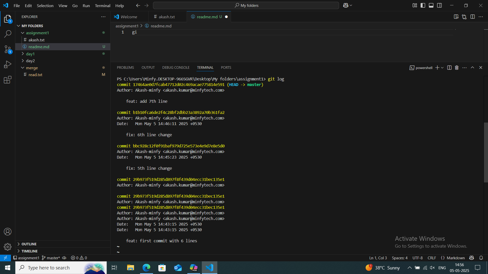

#Assignment 1 and 2  

#Akash Kumar  
#first commit  
Created akash.txt with 6 lines then added that to stage and then made the intial commit  

#content after 1st commit  
Hello, I am Akash  
From IIIT Kurnool  
I am originally from Ranchi, Jharkhand  
I love to code  
I love table tennis  
I love to learn  

Then I made 3 changes in the file which is shown in the screenshot attached in this readme  

#1st change  
fix: 5th line change  
I love table tennis and vollyball  

#2nd change  
fix: 6th line change  
I love to learn and grow  

#3rd change  
feat: add 7th line  
I am working in minfy  

#FEATURE BRANCH CREATED IN ASSIGNMENT2  

